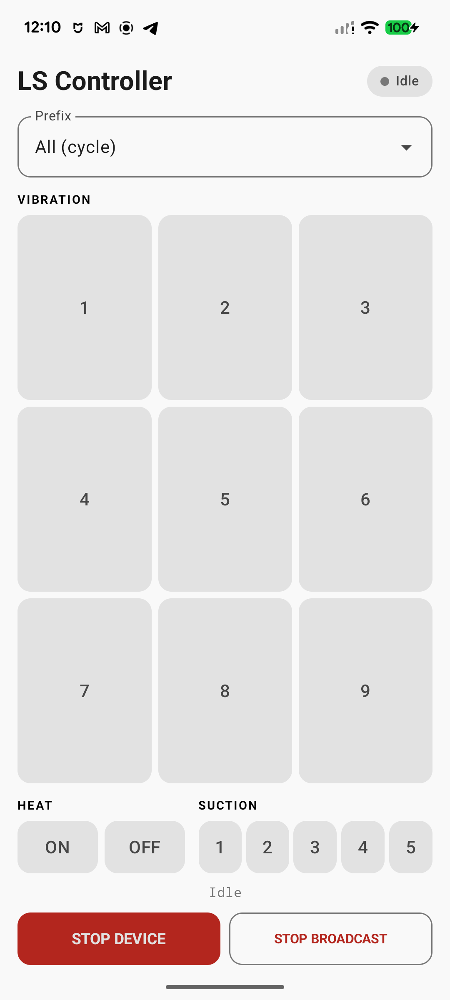

# Love Spouse Controller

An independent, offline Android controller for intimate devices using the
Love Spouse / Weibu IoT Bluetooth Low Energy advertising protocol. No pairing,
account, Internet access, or official companion app is needed.



## Features

- Nine vibration modes.
- Heat on/off commands and five suction levels on supported devices.
- Cycle through five included prefixes, or target a specific device family.
- Material You colors on Android 12+, with light and dark themes.
- English interface, screen-reader labels, and scrolling on smaller screens.
- No ads, analytics, accounts, location permission, or cloud services.

Compatibility depends on firmware; support for every device or function is
not guaranteed. The app cannot detect devices or receive acknowledgements.
Use it only with devices you own and with the consent of anyone using them.
This app is intended for adults.

## Install

Published builds, when available, are listed on
[GitHub Releases](https://github.com/hirusha-adi/love-spouse-controller/releases).
The repository is prepared for F-Droid submission; it is not yet listed there.
See [the submission guide](docs/FDROID.md).

A local debug build is `app/build/outputs/apk/debug/app-debug.apk`. Debug builds
use the separate `dev.hirusha.lscontroller.debug` ID to coexist with releases.

## Build from source

Use OpenJDK 17, Android SDK platform 35, and Build Tools 34.0.0. Gradle 8.7 and
Android Gradle Plugin 8.6.1 are pinned. Android Studio is optional.

```bash
export ANDROID_HOME=/path/to/android-sdk
"$ANDROID_HOME/cmdline-tools/latest/bin/sdkmanager" "platforms;android-35" "build-tools;34.0.0"
./gradlew --no-daemon --dependency-verification strict assembleDebug assembleRelease lintRelease
python3 tools/check_metadata.py
```

Alternatively, put `sdk.dir=/path/to/android-sdk` in untracked `local.properties`.
Install the debug build with `adb install app/build/outputs/apk/debug/app-debug.apk`.
The unsigned release is `app/build/outputs/apk/release/app-release-unsigned.apk`.
F-Droid builds and signs this same release variant. See [release instructions](docs/RELEASING.md)
for signing and reproducibility checks. No API keys or signing secrets are needed to build.

## Usage

1. Turn on Bluetooth and grant advertising permission when prompted on Android 12+.
2. Select **All (cycle)** if the prefix is unknown, or select a specific prefix for a faster response.
3. Tap a vibration mode, heating command, or suction level. Only one command is broadcast at a time.
4. **STOP DEVICE** broadcasts a stop command. **STOP BROADCAST** or tapping the selected control again ends transmission without sending a stop command. A device may continue its last action.

All-prefix mode rotates through five prefixes at approximately 300 ms per
successful advertisement, plus startup time. It may affect multiple nearby
devices. Prefix counts describe catalog entries, not connected or nearby devices.

## Permissions and privacy

Android 12+ uses `BLUETOOTH_ADVERTISE`; Android 8–11 uses normal `BLUETOOTH` and
`BLUETOOTH_ADMIN` permissions. Android 8.0+ and BLE advertising support are required.
No Internet, scanning, location, or Bluetooth connection permission is needed.
See [PRIVACY.md](PRIVACY.md).

## Contributing

Report bugs or compatibility details in the
[issue tracker](https://github.com/hirusha-adi/love-spouse-controller/issues).
Keep the interface and store listing in English. Include the version-code
changelog in `fastlane/metadata/android/en-US/changelogs/` when preparing
releases, and run the checks above.

## License

Project code, documentation, and original artwork are
[MIT licensed](LICENSE). Gradle wrapper files remain Apache-2.0; see [NOTICE](NOTICE).
Editable artwork is in `artwork/`; `tools/render_artwork.sh` regenerates store
graphics using librsvg and DejaVu Sans fonts. The project is independent of
Love Spouse and device manufacturers.
